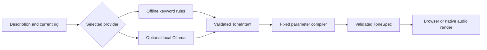
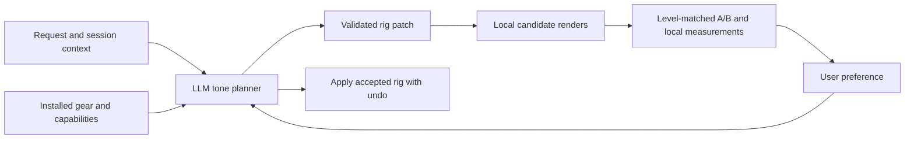

# Download investigation and tone quality roadmap

Investigation date: 2026-10-03. Reviewed published revision: `3f6c276`.
This is an investigation and proposed implementation route; the features below
have not been implemented or accepted merely by documenting them.

## Findings and evidence

The active browser workbench at `http://127.0.0.1:5173/` shows disabled
**Browse amp models** and **Browse cabinet IRs** buttons, zero local assets, and
the **Offline tone rules** provider. These observations explain why this browser
session cannot download captures or demonstrate an LLM agent. A separate failure
in the native app is not yet reproduced.

The native bundle exists at
`apps/desktop/src-tauri/target/debug/bundle/macos/Toney.app`.
Open that application, browse an amp capture, finish TONE3000 selection, download
a variant, choose it under **Amp model**, and render with **Native DSP + NAM / IR**.
Repeat for an IR. The download installs a file; it does not automatically change
the rig. Account authorization and a production file download were explicitly
unverified at checkpoint 007 and remain acceptance gates.

Several source files and the Git index in the WorkFiles checkout have macOS
`dataless` flags. Their reads stalled even outside the sandbox. Requesting
`brctl download` did not make them readable during this investigation. Source
inspection therefore used a temporary fresh clone at the exact published
revision above; it does not establish the state of any unreadable local edits.
Restore local availability with Finder's **Download Now / Keep Downloaded** option
for Toney before rebuilding in that checkout.

### Download failure map

| Visible stage | Current behavior / candidate | Next evidence and correction |
| --- | --- | --- |
| Browser buttons disabled | Confirmed: downloads invoke native Tauri commands and are unavailable in the browser harness. | Use the desktop bundle. Make the browser/desktop distinction and launch instructions prominent. |
| Browser opens; selection never returns | OS scheme registration or redirect settings; malformed callbacks are silently ignored; authorization expires after ten minutes. | Verify a real `toney://tone3000/callback` return to the running bundle. Show safe callback/timeout stages without logging the URL, code or token. |
| Tone selected; metadata fails | Strict gear, format, architecture, metadata and URL checks. | Compare a sanitized production response against contract fixtures; preserve bounds and correct confirmed schema differences. |
| Variant shown; download fails | First-party API URL restriction, redirect rejection, authorization, rate limit or network error. | Record error code/request ID and HTTP status. Compare actual delivery with the official reference client before changing origin/redirect policy. |
| Bytes arrive; import fails | Classic mono A1/LSTM files only, versions 0.5.0–0.5.4; bounded native preflight. | Record helper error and model architecture/version. Add supported newer formats through an engine upgrade and regression tests. |
| Download succeeds; tone still basic | Installed asset has not been selected, browser renderer is selected, or input is the synthetic phrase. | Explicit model selection, native render and realistic bundled guitar audition. |

The official [TONE3000 reference client](https://github.com/tone-3000/api)
authenticates model downloads and retries once after a 401 refresh. Toney refreshes
proactively, but lacks that reactive retry. Its transport rejects every redirect;
the reference browser fetch follows redirects. Neither difference proves the
reported native failure. Do not broaden credential forwarding based on a guess.

## How the agent currently works

Relevant files: `core/agent/agent.ts`, `core/agent/interpreter.ts`,
`core/agent/ollama.ts`, `core/tone/compiler.ts`, and `apps/desktop/src/App.tsx`.

- The default provider is regex rules with five broad style profiles: grunge,
  blues, funk, ambient and metal. Artist cues are approximations.
- Optional Ollama uses a user-entered installed model; the initial UI value is
  `llama3:latest`. That value is not proof that the model is installed or in use.
- Both providers emit the same restricted intent: eleven numeric dimensions,
  one distortion texture, references, changed fields and two correction flags.
- The compiler adjusts a starting chain of eight effect types and 23 controls.
  Existing selected assets, manual controls, order and bypass states are preserved.
  It does not choose a NAM file, search the catalog or design a different topology.
- The generated explanation is templated locally. The model does not converse
  about alternatives, execute tone tools, hear the render or learn from A/B choices.
- The baseline is inferred approximately from current knobs, not measured audio.
  The default audition is synthetic plucked strings. Both limit tonal judgments.
- Existing traces record request validation, interpretation, compilation and output
  validation. They do not yet describe a gear selection / audition loop.

There are continuously adjustable rigs, not just five available tones. However,
the expressive range is constrained by the fixed processors and compiler.

### Do we need a better model?

A stronger language model is a reasonable hypothesis for understanding nuanced
requests, named references, contradictions and follow-ups. It cannot add a pedal
algorithm or improve NAM capture quality by changing its wording. Even an excellent
model currently ends at the same small intent schema.

Measure the change using the same prompts and rig state across offline rules,
the actually installed Ollama model and eligible ChatGPT models. Evaluate requested
changes, preserved controls, unsupported requests, invented gear, JSON validity,
latency, usage and user preference. Do not label a provider superior before this
comparison. Choose from the signed-in account's live model catalog rather than
hard-coding an assumed subscription entitlement.

## Better pedals without manual uploads

| Route | What it adds | Fit for Toney |
| --- | --- | --- |
| NAM pedal captures | Drive, boost and fuzz captures from actual gear. | Add a separate NAM drive block with independent state, input/output trims and selected-pedal attribution. Current external NAM support is amp-only. |
| Circuit models | Controls with meaningful drive/tone interactions; oversampled nonlinear processing. | Evaluate selected processors from [ChowDSP BYOD](https://github.com/Chowdhury-DSP/BYOD), which includes modeled distortion circuits. Its GPLv3/alternative licensing needs a deliberate integration choice. |
| Algorithmic effects | Tape/BBD-style delay, modulation, phaser, tremolo, richer reverbs and dynamics. | Evaluate selected [Airwindows](https://github.com/airwindows/airwindows) processors. The repository is MIT licensed; preserve notices and benchmark the actual algorithms chosen. |
| Plugin hosting | User-installed AU/VST3/CLAP effects and free pedal plugins. | Later expansion: scanning, state restoration, UI hosting, latency and process isolation make this a larger checkpoint. |

Recommended initial combination: NAM drives + NAM amp + measured cab IR + a small
curated set of improved algorithmic effects. Normal stationary captures do not
give a complete adjustable delay/reverb/modulation pedal. Snapshot controls should
be labeled as trims or post-EQ. Parametric NAM is possible, but it needs compatible
models and runtime support; see the official
[ParametricOD demonstration](https://www.neuralampmodeler.com/post/the-first-publicly-available-parametric-neural-amp-model).

The [NAM Core releases](https://github.com/sdatkinson/NeuralAmpModelerCore/releases)
now include A2 support; Toney still pins v0.3.0. Evaluate the newer core, extend
preflight for its architectures, and run both old A1 and new A2 fixtures before
widening catalog filters. A2 support and parametric pedal support are separate work.

TONE3000's [documented integration terms](https://www.tone3000.com/api) permit the
hosted selection flow for a free prototype. Build recommendations around locally
installed gear, hosted user selection, and permitted bounded lists. A fully custom
catalog search should not become an assumed free-tier dependency. Capture licenses
still determine redistribution; download-on-selection avoids bundling unknown
rights. Bundle licensed DI examples so listening needs no user upload.

## Sign in with ChatGPT: feasible for this prototype

The current [OpenAI developer overview](https://developers.openai.com/siwc/token-sharing-open-source)
documents ChatGPT plan usage for open-source and locally hosted apps. Toney's local
personal prototype has a documented route; paid or remotely hosted distribution
requires a separate eligibility review. It is not implemented in Toney today.

Eligible Plus/Pro users can consent to plan usage separately from signing in.
Usage shares existing limits, and users can cap or revoke app access. Signing in
does not transfer ChatGPT conversations or memories into Toney.
See [user plan controls](https://learn.chatgpt.com/docs/sign-in-with-chatgpt).

Implementation checkpoints:

1. Native OAuth PKCE, random state and nonce, a stable installation host ID, and
   dynamic OSS registration. Save the issued client ID. Start the loopback listener
   before opening the browser. This flow uses HTTP `127.0.0.1`, not Toney's existing
   TONE3000 custom scheme. Validate ID tokens and granted scopes; keep credentials
   in native secure storage. Follow [registration documentation](https://developers.openai.com/siwc/token-sharing-open-source/sign-in).
2. Add a ChatGPT provider alongside offline/Ollama. Populate a model picker from
   the authenticated account's catalog and call the public Responses endpoint.
   Handle streaming completion, interruptions and usage limits. Follow
   [models and inference](https://developers.openai.com/siwc/token-sharing-open-source/models-and-inference).
3. Use narrow validated local tone tools, bounded iterations and an atomic rig
   change. Every render remains local. Send prompt, rig descriptions and chosen
   local measurements only with the user's opt-in cloud provider selection.

This plan-usage preview requires streaming and `store:false`; Toney must manage
conversation history itself. It does not support audio/video input or the audio
transcription/upload APIs. Local audio analysis can supply measurements, but we
cannot promise that this sign-in route lets GPT listen directly to guitar audio.
See [preview limitations](https://developers.openai.com/siwc/token-sharing-open-source/preview-limitations).

## Proposed checkpoints

Each row is a short, independently reviewable checkpoint: implement, run focused
tests, commit, offer an interactive acceptance path, then pause for feedback.

| Order | Deliverable | Evidence required before acceptance |
| --- | --- | --- |
| 1 | Desktop download acceptance and actionable diagnostics | Real account selection → one amp and IR installed → native render → restart/offline reuse. Reproduce and fix any native error; never call fixtures live proof. |
| 2 | Bundled realistic DI audition with level-matched A/B | A few cleared guitar phrases; one-click dry/processed comparisons; existing synthetic source still available. No upload needed. |
| 3 | ChatGPT sign-in checkpoint | Real user consent, secure credential handling, current model picker, completed inference, cancellation/expiry/revoke/limit cases. |
| 4 | Stronger interpretation checkpoint | Same-schema provider comparison on a small curated prompt suite; preserve edits, show useful explanations and clarification requests. |
| 5 | NAM pedal block and A2 engine checkpoints | Pedal + amp + IR audible example, independent state/bypass/reload tests; A1 regression and actual A2 fixture processing. Split these if engine work is substantial. |
| 6 | One improved effect at a time | Start with a controllable overdrive or tape delay, then chorus/phaser/reverb. Compare native renders, tail behavior, aliasing, levels and CPU against baseline. |
| 7 | Gear-aware agent with local tools | Agent can list available gear, propose validated patches, render two candidates, explain changes and honor a user preference. No invented asset IDs or unauthorized downloads. |
| 8 | Feedback and live guitar | Persist preferences; analyze local spectral/dynamic summaries; then device input, calibration, smooth parameter changes and measured callback latency/dropout tests. |

### Target agent loop

Keep request IDs through provider calls, tool calls, asset inspection, render and
rig revision. Record provider/model, timings, selected content hashes, validation
failures and parameter diffs. Exclude OAuth codes, bearer tokens and signed delivery
URLs. Prefer bounded retries and explicit failure stages to silent fallback.
